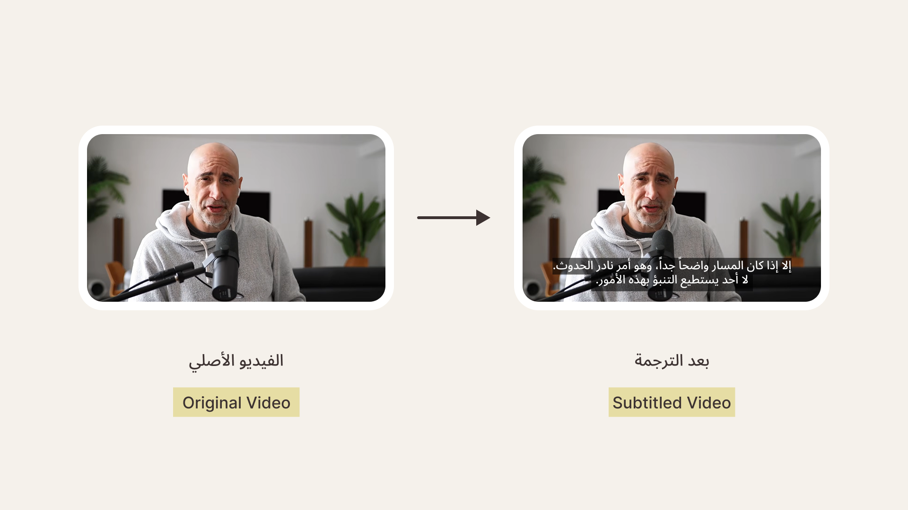

# Automatic Video Translator & Subtitler

A 100% private, local AI pipeline to transcribe English videos, translate the text into Arabic, and generate subtitled videos.

## System Requirements & Installation

Before running the scripts, ensure you have the following prerequisites configured on your machine.

1. **External Dependencies**

- FFmpeg: Must be installed and added to your system's PATH.

- Ollama: Download and install Ollama. Once installed, pull the specialized translation model by running the following command in your terminal:

```bash
ollama run translategemma
```

2. **Python Dependencies**

Install the required Python modules via pip:

```bash
pip install faster-whisper torch gradio pandas requests
```

> Note: `gradio`, `pandas`, and `torch` are only required if you want to use the web interface (`app.py`). If you prefer to use the command-line interface (`batch_processor.py`), you can completely ignore those extra packages and install only the core dependencies (`faster-whisper` and `requests`).

# Project Structure

1. **app.py (Interactive Web Interface)**
The primary application. It launches a local web browser interface where you can drag-and-drop a video, generate an automatic Arabic translation, click into a spreadsheet grid to manually tweak or fix any typos, and export the finished video.

To run: `python app.py`

2. **batch_processor.py (Command-Line Automated Pipeline)**
A headless, script-only version of the tool. It automatically runs transcription, translation, and video rendering sequentially without any user intervention. Perfect for background processing.

To run: Open the file, update the `INPUT_VIDEO_PATH` and `OUTPUT_VIDEO_PATH` variables at the bottom, then run: `python batch_processor.py`

3. **extract_text.py (Text-Only Extractor)**
A lightweight utility script that processes a video to transcribe its dialogue and outputs the raw text straight to your console terminal. Useful if you only need the transcript text data for other documentation purposes.

To run: `python extract_text.py`